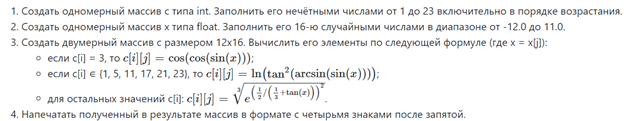

# first-java-project
Базовый проект для знакомства с JVM и синтаксисом Java.
## ТЗ

## Используемые технологии
- Язык Java. Особенности языка.
- Средства разработки. JDK и JRE. Компиляция и выполнение программы. JAR-архивы.
- Примитивные типы данных в Java. Приведение типов.
- Работа с переменными. Декларация. Инициализация. Присваивание.
- Одномерные и двумерные массивы. Декларация и создание массивов. Доступ к элементам массива.
- Инструкции ветвления (if-else, switch) и циклов (do, while, for).
- Операторы и выражения в Java. Особенности вычисления, приоритеты операций.
- Математические функции в составе стандартной библиотеки Java. Класс java.lang.Math.
- Подпрограммы, методы, параметры и возвращаемые значения.
- Форматированный вывод числовых данных.
